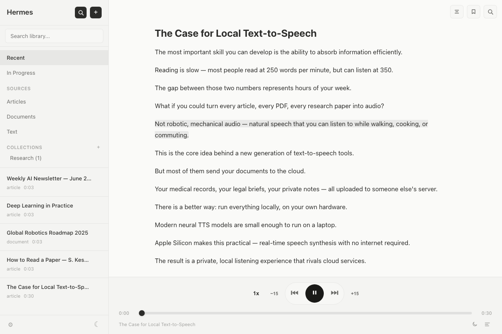

# Hermes

Turn anything you read into something you hear — privately, on your Mac.

[](LICENSE)
[](https://github.com/shreyas23/hermes/releases)
[](https://www.python.org)

Local macOS app that converts documents, articles, and feeds into audio. Runs entirely on-device — no accounts, no cloud, no subscriptions.



**Supports:** PDF, DOCX, Markdown, HTML, RTF, plain text, web URLs, RSS/Atom feeds, YouTube

## Install

Download `Hermes-<version>-mac.dmg` from the [latest release](https://github.com/shreyas23/hermes/releases). Open the DMG and drag Hermes to Applications.

On first launch, macOS may show a security warning. To open it, run this once in Terminal:

```bash
xattr -cr /Applications/Hermes.app
```

## Why Hermes?

Most listen-to-anything tools (Speechify, ElevenReader, etc.) run in the cloud, require subscriptions, and send your documents to someone else's server.

- **Private** — everything stays on your machine. No accounts, no uploads, no tracking. Safe for work documents, legal files, medical records.
- **Multiple TTS engines** — five engines from built-in system voices to neural models running locally on Apple Silicon. Pick quality vs. speed per item.
- **Teleprompter** — text scrolls in sync with audio, sentence by sentence. Click any sentence to jump there. Combine reading and listening for better retention.
- **Desktop-native** — global media keys, menu bar presence, watch folders that auto-import new files. Lives where you already work.
- **No subscription** — free and open source. No per-minute limits, no premium tiers.

## Features

- **Teleprompter** — sentence-synced scrolling with click-to-jump
- **Multiple TTS engines** — Edge TTS (online), macOS Say, Kokoro (local CPU), Kokoro MLX (local GPU), Piper (local, fast). Per-item engine selection via split button
- **Playback** — cached audio with native seeking, 0.5x–2x speed, auto-resuming progress
- **Play queue** — line up items for back-to-back playback, Play Next / Add to Queue via right-click
- **Sleep timer** — auto-pause after a set duration or at end of current item
- **Global media keys** — play/pause/skip from anywhere via Media Session API
- **Discover** — search Wikipedia, subscribe to RSS/Atom feeds and Substack newsletters
- **Import** — URL, file, folder scan, drag-and-drop, watch folders (auto-import), pasted text, YouTube
- **Reading tools** — transcript search, bookmarks & annotations
- **Library** — collections, source-type filtering, search, structured PDF navigation (TOC, chapters)
- **Design system** — three visual themes (Ink, Glass, Aurora) with light/dark modes, plus custom theme support

## Controls

| Key | Action |
|-----|--------|
| `Space` | Play / Pause |
| `Left` / `Right` | Previous / next sentence |
| `-15` / `+15` | Skip 15 seconds |
| `Escape` | Stop |

## TTS Engines

| Engine | Type | Quality | Speed | Notes |
|--------|------|---------|-------|-------|
| Edge TTS | Online | High | Fast | Microsoft neural voices, requires internet |
| macOS Say | Local | Low | Fast | Built-in system voices |
| Kokoro | Local (CPU) | High | Moderate | 82M param model, 28 English voices, auto-downloads ~120MB |
| Kokoro MLX | Local (GPU) | High | Fast | Apple Silicon GPU/ANE, same voices, ~2GB memory |
| Piper | Local (CPU) | Medium | Fast | Lightweight per-voice models (~30MB each), 22050Hz native |

Select the default engine in Settings. Override per-item via the dropdown on the Generate button.

**Privacy note:** Edge TTS sends your text to Microsoft's text-to-speech service for audio generation. No text is stored or logged — processing is real-time only. No account or personal identifiers are required. See the [Edge TTS privacy policy](https://edge-tts.com/privacy/) for details. All other engines run fully on-device.

---

## Development

Requires macOS, Python 3.12+, and [uv](https://docs.astral.sh/uv/).

```bash
git clone https://github.com/shreyas23/hermes.git && cd hermes
uv sync && npm install
uv run python app.py
```

Flask on `:5123`, PyWebView opens a native WebKit window.

### Architecture

```
PyWebView (WebKit)
├── Sidebar (library, nav, collections, search)
├── Teleprompter (sentence-synced scrolling, TOC panel)
├── Controls (scrubber, speed, skip, queue, sleep timer)
└── Settings (appearance, TTS, statistics, storage)

Flask (port 5123)
├── /api/library, /api/import, /api/settings, /api/stats
├── /api/voices — per-engine voice listing
├── SSE for generation progress
├── extractors.py — PDF/DOCX/HTML/MD/RTF/TXT
├── engines/ — TTS engine abstraction (edge, say, kokoro, kokoro-mlx, piper)
├── audio.py — orchestrator (ThreadPoolExecutor → concat → cache)
└── models.py — SQLite (library.db)
```

### Audio pipeline

1. Sentence split via [pysbd](https://github.com/nipunsadvilkar/pysbd)
2. Per-sentence WAV via the selected TTS engine
3. Concatenate into `master.wav`, convert to M4A
4. Record sentence→timestamp mapping for teleprompter sync
5. Cache — subsequent plays are instant with native seeking

### Data

```
~/hermes-library/
├── library.db           # SQLite: metadata, text, timelines, progress, settings
├── audio/<item_id>/
│   └── master.m4a       # Cached audio (M4A with WAV fallback)
└── models/              # Downloaded TTS model files (Kokoro, Piper)
```

Original files are not copied. Only extracted text is stored.

### Testing

```bash
uv run pytest              # Python unit + integration tests
npm run e2e:all            # Playwright E2E tests (runs on port 5199)
```

### Extending

**New format:** Add extension to `SUPPORTED_EXTENSIONS` in `extractors.py`, implement `_extract_<format>()`, add to dispatch table.

**New TTS engine:** Create `engines/<name>.py` with a `TTSEngine` subclass implementing `generate_sentence()` and `list_voices()`. Register in `engines/__init__.py`. Add voice setting to `models.DEFAULTS` and `_ALLOWED_SETTINGS` in `app.py`. Add UI option in `templates/index.html` and `static/js/settings.js`.

### Building the DMG locally

```bash
git clone https://github.com/shreyas23/hermes.git && cd hermes
uv sync
uv run pyinstaller hermes.spec --noconfirm
mkdir -p dist/dmg
cp -R dist/Hermes.app dist/dmg/
ln -s /Applications dist/dmg/Applications
hdiutil create -volname "Hermes" -srcfolder dist/dmg -ov -format UDZO dist/Hermes.dmg
```

The DMG will be at `dist/Hermes.dmg`. Open it and drag Hermes to Applications. The same Gatekeeper bypass above applies to locally-built copies.

### Dependencies

Python: [uv](https://docs.astral.sh/uv/) managed. Key packages: flask, pywebview, pymupdf, python-docx, beautifulsoup4, striprtf, pysbd, trafilatura, kokoro-onnx, piper-tts.

Node: playwright (E2E tests only).

## Contributing

Contributions are welcome. The frontend is vanilla HTML/CSS/JS with no build step, so you can start editing immediately.

Good first areas: new document format extractors, TTS engine integrations, UI improvements, bug fixes. Check the [issues](https://github.com/shreyas23/hermes/issues) for ideas.

To contribute: fork the repo, create a branch, test with real documents (`uv run pytest` for unit tests, `npm run e2e:all` for E2E), and open a PR.

## License

[AGPL-3.0](LICENSE)
